# Code For Good: STORM Center Virtual Drop-in Center
October 18-19th, 2024
Plano, TX

## Table of Contents
- [Project Overview](#project-overview)
- [Features](#features)
- [Technologies Used](#technologies-used)
- [Team Members](#team-members)
- [Setup and Installation](#setup-and-installation)
- [Usage](#usage)
- [Contributing](#contributing)
- [License](#license)

## Project Overview

The STORM Center Virtual Drop-in Center is a digital platform developed during the Code For Good Hackathon. It aims to support vulnerable youth and young adults, particularly those impacted by foster care, homelessness, and the child protective services system. The platform provides immediate access to resources, support, and engagement opportunities, addressing the critical needs identified by STORM Center of Hope and Service.

## Features

- User Authentication and Onboarding
- Points Gamification System
- Resource Page with Google Maps Integration
- Events Page with QR Code Scanner
- Community Chat
- Emergency Call Notifications (Twilio Integration)
- AI-powered Chatbot
- Rewards System
- YouTube Integration for Educational Content
- Real Time Powered Facetime + 1 on 1 Mentor Chat

## Technologies Used

- Next.js
- React
- TypeScript
- CSS
- Google Maps API
- Google Forms API
- OpenAI API
- YouTube API
- Twilio API
- Prisma ORM
- Supabase
- Clerk.js
- Chatbase(.co)

## Team Members

- Albert Yin (Texas A&M University): Mentor Meetings Page, login authentication, user onboarding page (Google Form API)
- BranDon Brown (Florida A&M University): Events Page, Git, Typescript, Javascript, CSS, Jest
- Blake Lee (University of Oklahoma): Resources Page, Google Maps integration, Chatbot, OpenAI integration
- Ephraim Sun (Southern Methodist University): Infrastructure, Next.js layout, landing page, UI Design, YouTube API, community chat, QR code scanner
- Mayra Sanchez (University of Texas at Austin): Database, Emergency Call feature, Twilio integration
- Bolutife Idowu (University of Houston): Rewards Page, Git, Typescript, Javascript, CSS

## Setup and Installation


1. Clone the repository
   ```
   git clone https://github.com/cfgtexas24/Team-20.git
   ```
2. Navigate to the project directory
   ```
   cd web
   ```
3. Install dependencies
   ```
   npm install
   ```
4. Set up environment variables (create a `.env` file in the root directory)
   ```
    YOUTUBE_API_KEY=
    DATABASE_URL=
    DIRECT_URL=
    NEXT_PUBLIC_AUTH_TOKEN=
    GOOGLE_API_KEY=
    STRING_64=
    NEXT_PUBLIC_CLERK_PUBLISHABLE_KEY=
    CLERK_SECRET_KEY=
    NEXT_PUBLIC_DYTE_CLIENT_ID=
    NEXT_PUBLIC_DYTE_AUTH_TOKEN=
    NEXT_PUBLIC_PHONE_NUMBER=
    TWILIO_ACCOUNT_SID=
    TWILIO_AUTH_TOKEN=
    TWILIO_PHONE_NUMBER=
   ```
5. Run the development server
   ```
   npm run dev
   ```

## Contributing

We welcome contributions to improve the STORM Center Virtual Drop-in Center. Please follow these steps to contribute:

1. Fork the repository
2. Create a new branch (`git checkout -b feature/AmazingFeature`)
3. Commit your changes (`git commit -m 'Add some AmazingFeature'`)
4. Push to the branch (`git push origin feature/AmazingFeature`)
5. Open a Pull Request

---

Developed with ❤️ for STORM Center of Hope and Service during the Code For Good Hackathon.

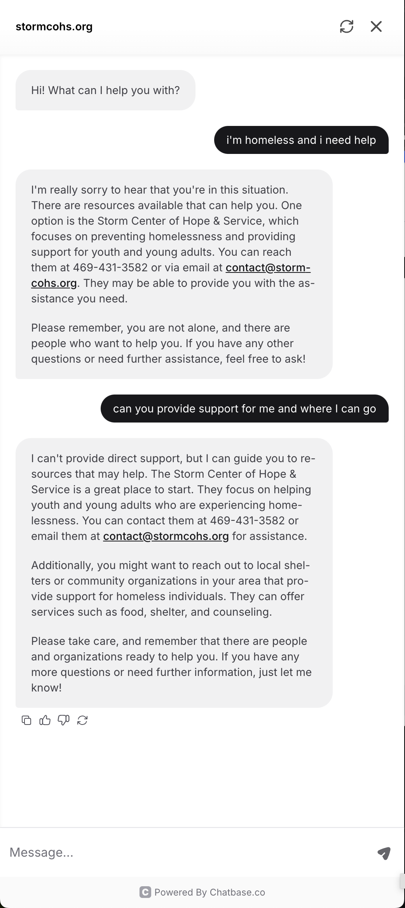
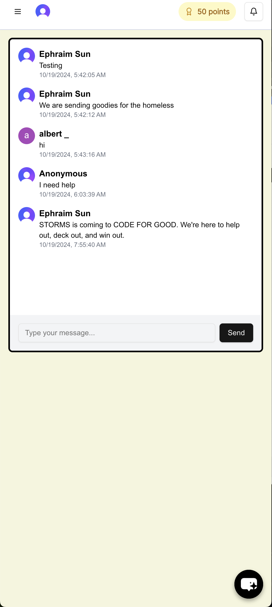
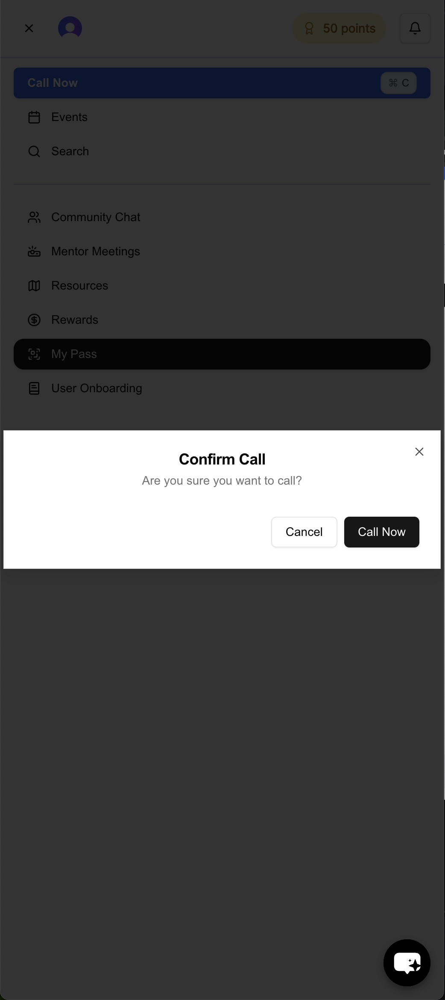
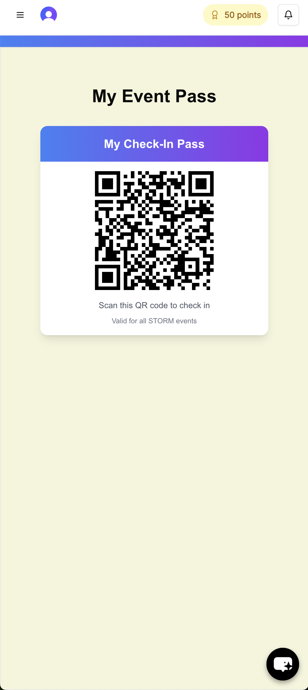
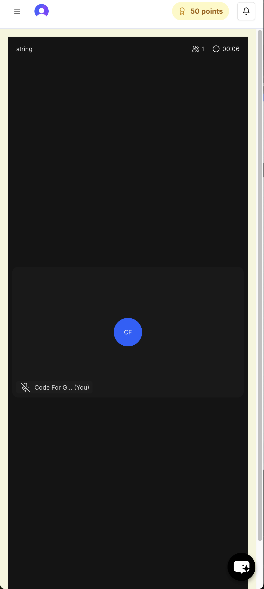
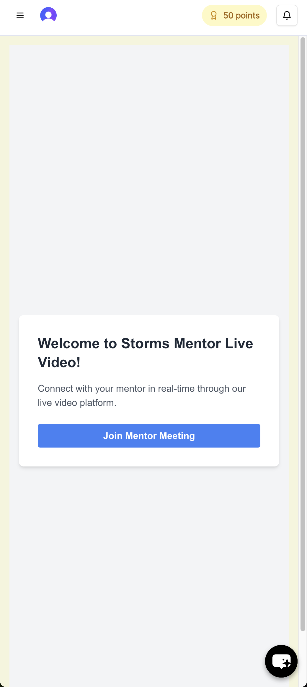
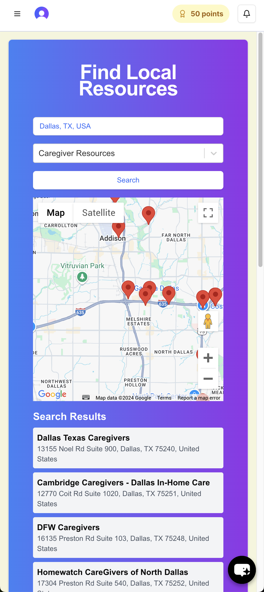
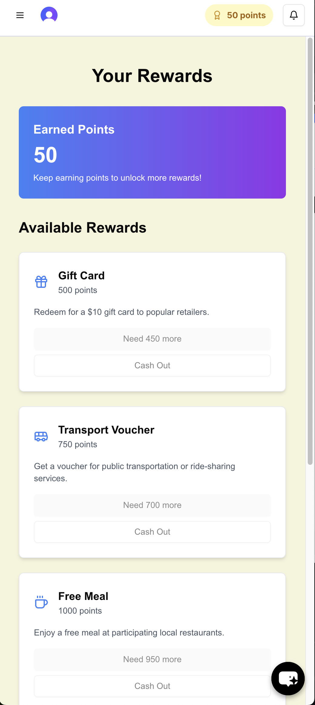
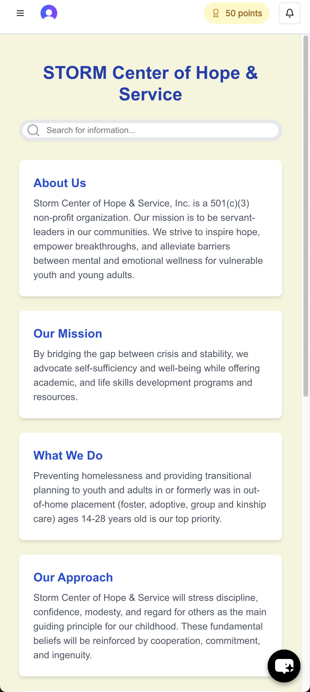
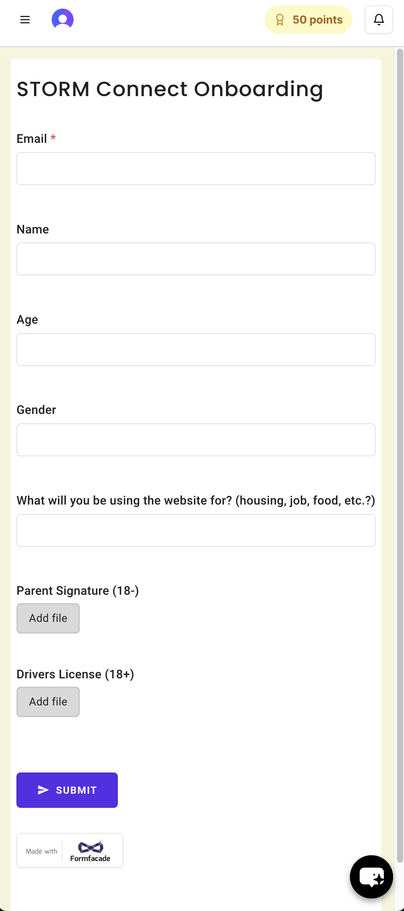

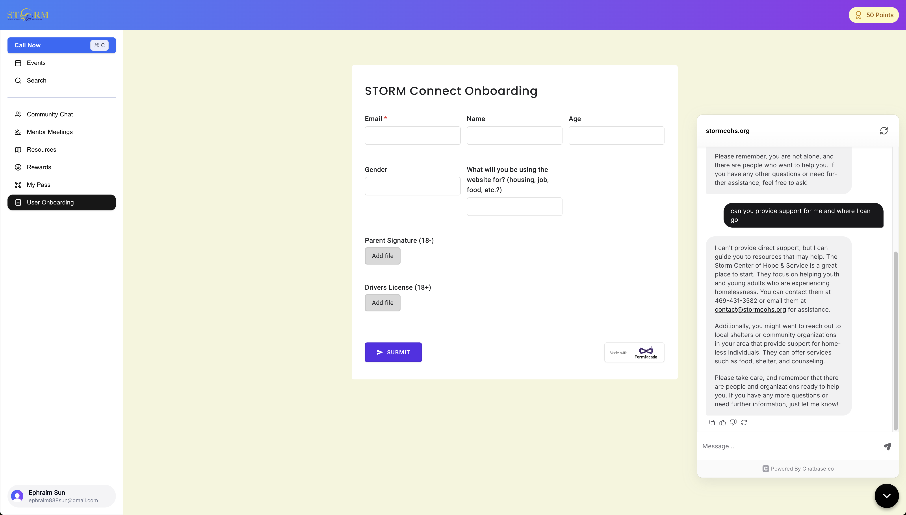
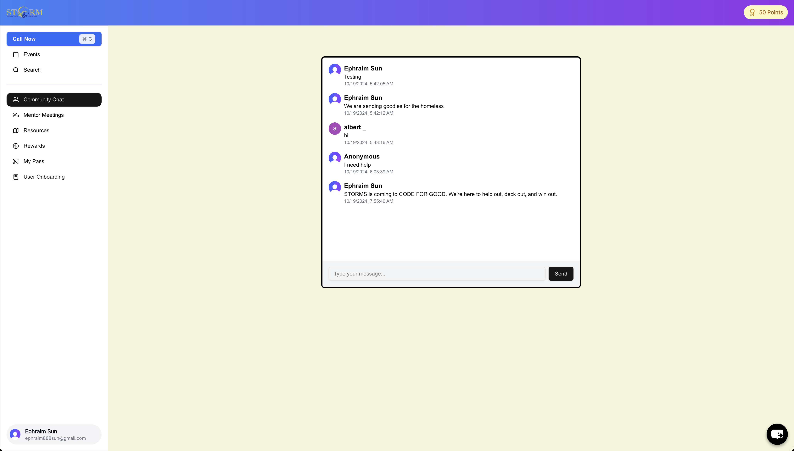
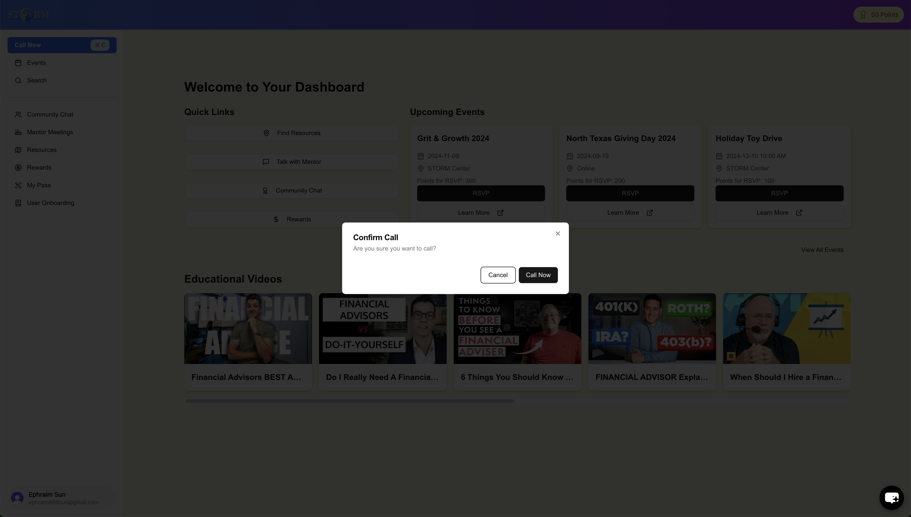
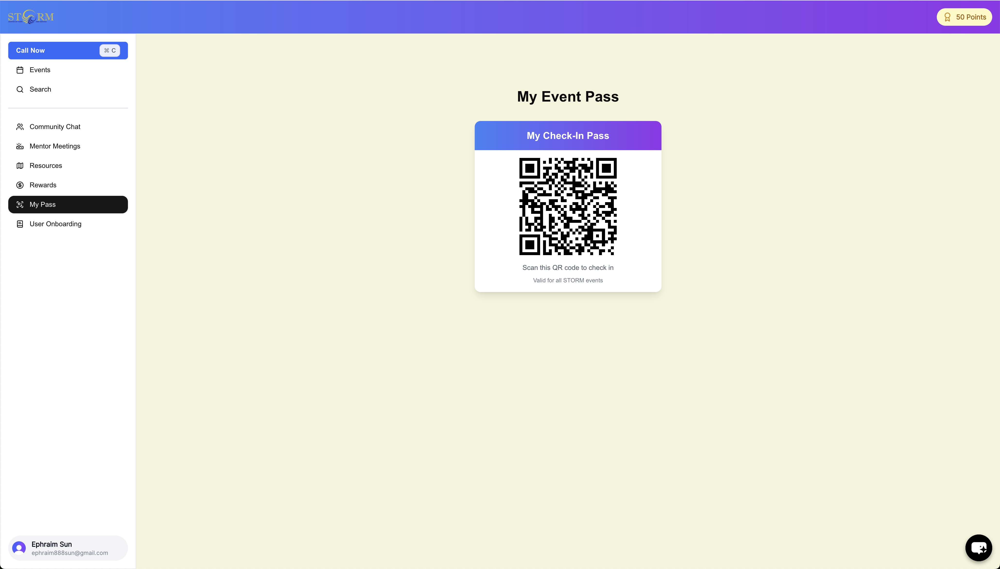
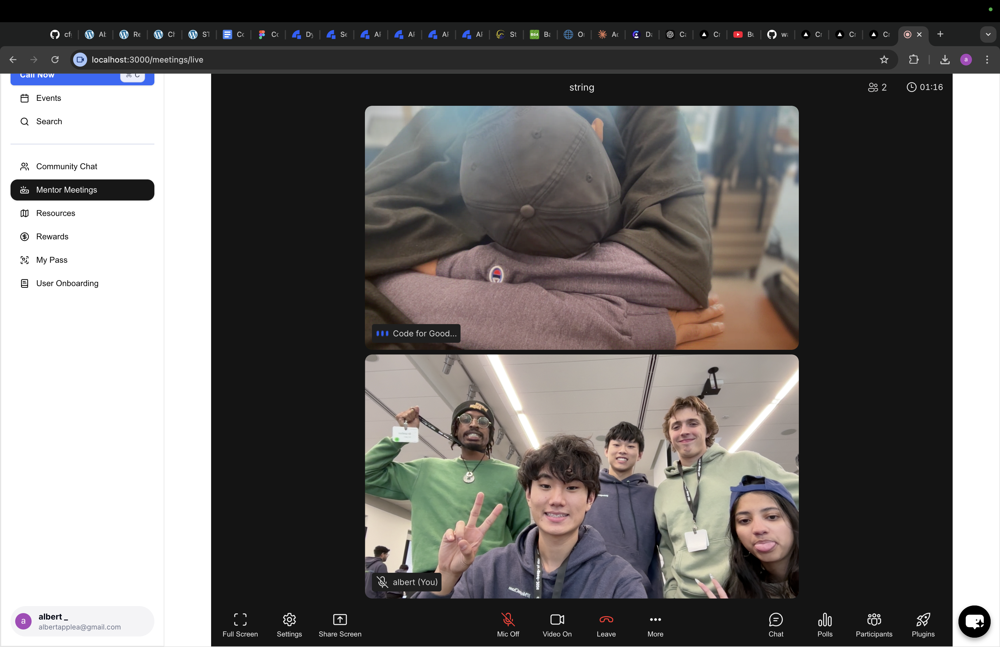
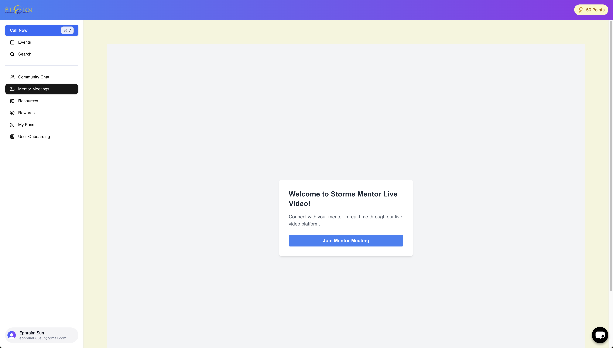
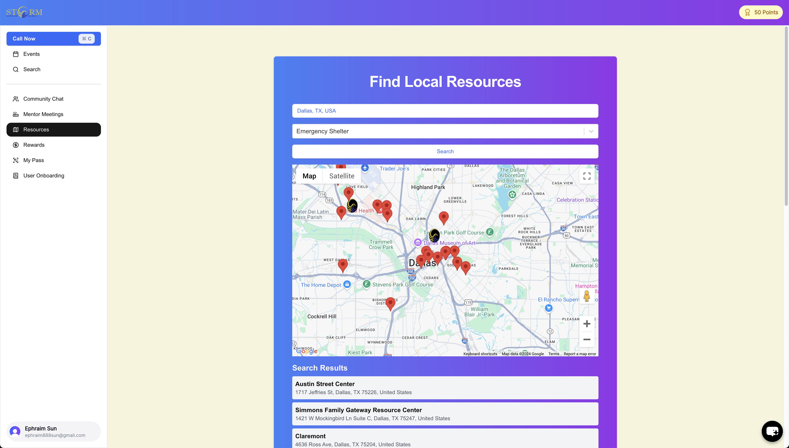
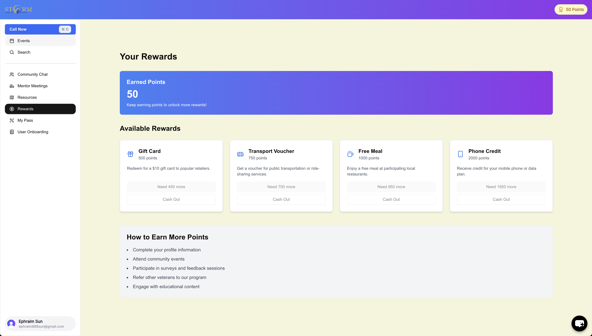
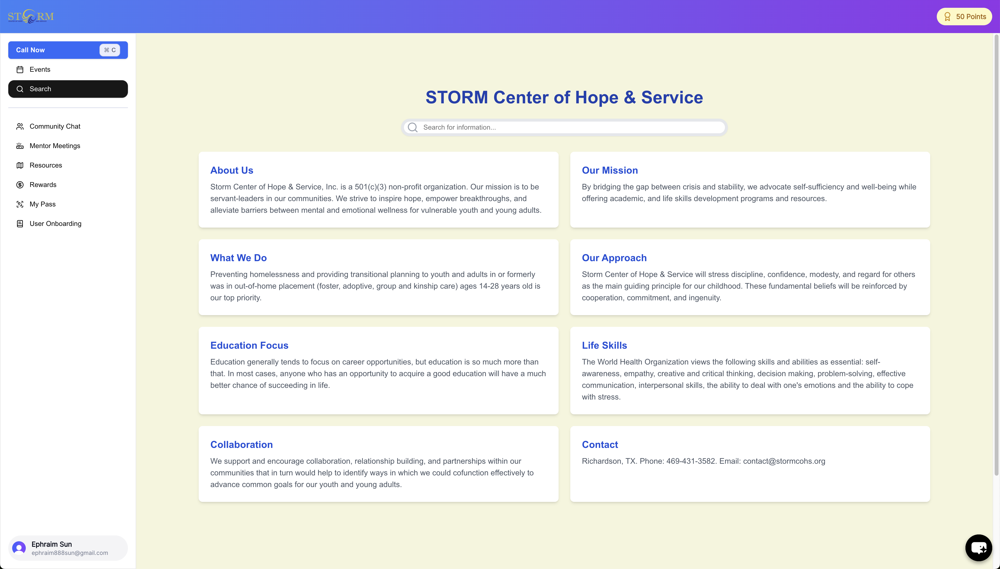


